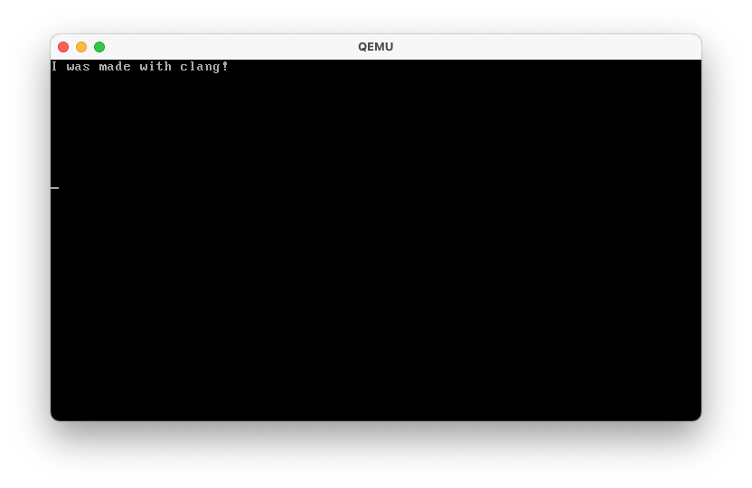

# clang-kernel-demo
A primitive demo of Clang being used to compile a super simple 'kernel' (loose term) 
for the i686 (x86) architecture. While this is not a full kernel, this demo shows a super 
minimal example of getting bare-metal software to compile using Clang. This demo is based on 
this [project](https://github.com/Henje/x86-Toy-OS/) to help me focus purely on build aspects.



# Building
This sample uses only Clang, making it easy to build. The build process is simply 
a script to keep things simple, but of course this should not be done in a full 
project.

```
sh build.sh
```

If you are also a macOS user, I would avoid using Apple Clang and instead opt for 
a standard copy of Clang: I sourced mine via Homebrew. (`brew install llvm`)

# Run it!
This can be executed in Qemu without a bootloader via `-kernel bin/kernel.elf`